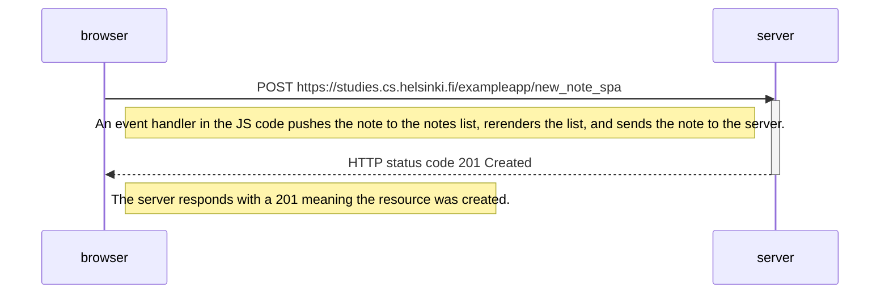

```mermaid
sequenceDiagram
    participant browser
    participant server

    browser->>server: POST https://studies.cs.helsinki.fi/exampleapp/new_note_spa
    activate server
    
    Note right of browser: An event handler in the JS code pushes the note to the notes list, rerenders the list, and sends the note to the server.
    
    server-->>browser: HTTP status code 201 Created
    deactivate server

    Note right of browser: The server responds with a 201 meaning the resource was created.
```
